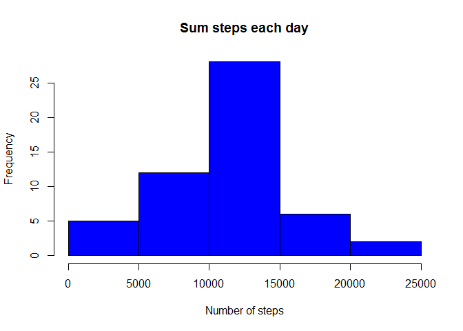
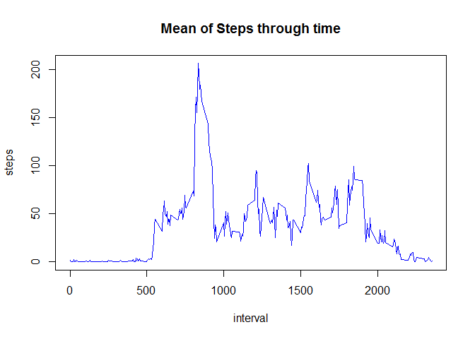
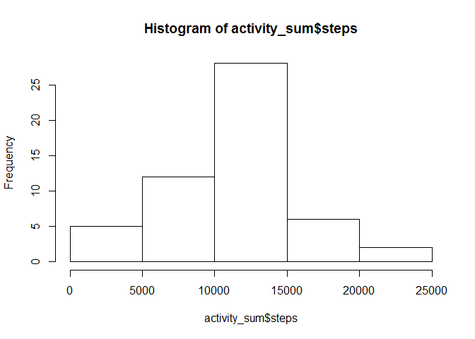
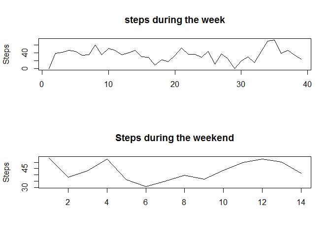

# Reproducible Research: Peer Assessment 1


## 1 Loading and preprocessing the data


```r
activity_raw <- read.table(unz("activity.zip", "activity.csv"), header = TRUE, sep = "," ,
                  stringsAsFactors = FALSE)
activity_raw$date <- as.Date(activity_raw$date)
```

## 2 Histogram of the total number of steps taken each day


```r
activity_sum <- aggregate(steps ~ date, activity_raw, sum, na.rm=TRUE)
hist(activity_sum$steps, main = "Sum steps each day", xlab="Number of steps", col = "blue")
```

<!-- -->

## 3 Mean and median number of steps taken each day


```r
steps_mean <- mean(activity_sum$steps)
steps_median <- median(activity_sum$steps)
```

The mean of the steps (without missing values) is 1.0766189\times 10^{4}
The median of the steps (without missing values) is 10765

## 4 Time series plot of the average number of steps taken


```r
activity_mean <- aggregate(steps ~ interval, activity_raw, mean, na.rm = TRUE)
plot(activity_mean, type = "l", main="Mean of Steps through time", col="blue")
```

<!-- -->

## 5 The 5-minute interval that, on average, contains the maximum number of steps


```r
activity_tidy <- na.omit(activity_raw)
activity_tidy[activity_tidy$steps == max(activity_tidy$steps), "interval"]
```

```
## [1] 615
```

## 6 Code to describe and show a strategy for imputing missing data


```r
activity_imputing_na <- na.omit(activity_raw)
```

## 7 Histogram of the total number of steps taken each day after missing values are imputed


```r
hist(activity_sum$steps)
```

<!-- -->

## 8 Panel plot comparing the average number of steps taken per 5-minute interval across weekdays and weekends


```r
library(lubridate)
activity_imputing_na$week_day <- wday(activity_imputing_na$date, label=TRUE)
activity_weekend <- activity_imputing_na[activity_imputing_na$week_day %in% c("Sun", "Sat"),]
activity_week <- activity_imputing_na[activity_imputing_na$week_day %in% c("Mon", "Tues", "Wed", "Thurs", "Fri"),]
activity_weekend_mean <- aggregate(steps~date, activity_weekend, mean)
activity_week_mean <- aggregate(steps~date, activity_week, mean)
par(mfrow=c(2,1))
plot(activity_week_mean$steps, type="l", xlab = "", ylab="Steps", main="steps during the week")
plot(activity_weekend_mean$steps, type="l", xlab="", ylab="Steps", main="Steps during the weekend")
```

<!-- -->
